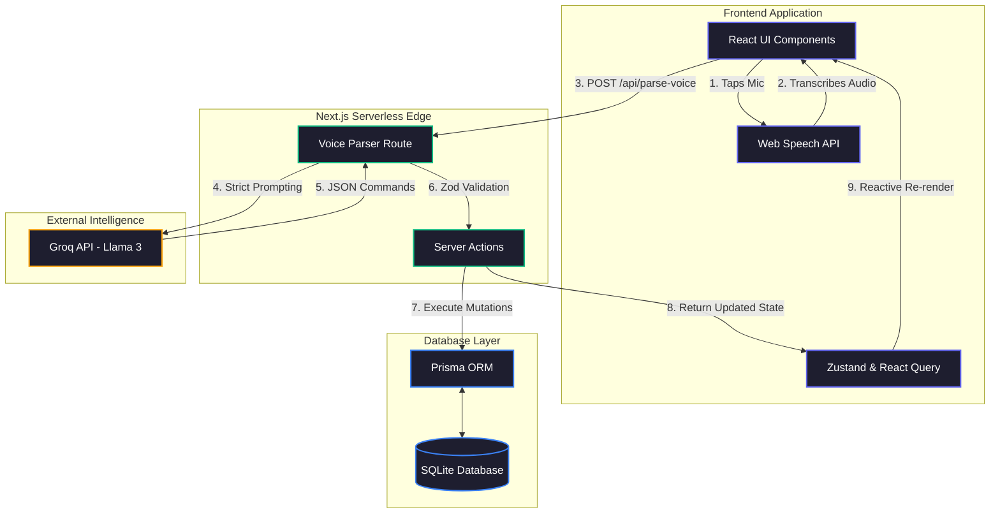

<div align="center">
  <div style="background: rgba(139, 92, 246, 0.1); padding: 20px; border-radius: 50%; display: inline-block; margin-bottom: 20px;">
    
  </div>
  
  # VoiceCart — AI Shopping Assistant

  **A modern, voice-powered grocery list manager built with Next.js, Groq, and Tailwind CSS.**
  <br />
  Say what you need, and AI organizes it for you.

  [](https://nextjs.org/)
  [](https://www.typescriptlang.org/)
  [](https://tailwindcss.com/)
  [](https://www.prisma.io/)
  [](https://groq.com/)
</div>

<hr />

## ✨ Features

- 🎙️ **Natural Voice Commands**: Uses the Web Speech API and Llama 3 to understand complex, multi-item commands (e.g., *"Add 2 apples, some bread, and a gallon of milk"*).
- 🌍 **Multilingual**: Speak your list in English, Spanish, French, or Hindi—the AI translates and categorizes it automatically.
- 🎨 **Dark-Mode Glassmorphism UI**: Beautiful, fully responsive interface built with Tailwind CSS and animated with Framer Motion.
- 🧠 **Smart Parsing**: Automatically categorizes items into aisles (Produce, Dairy, Meat, etc.) and tracks quantities and units.
- 🔍 **AI Search & Suggestions**: Recommends seasonal items, frequent purchases, and allows complex querying (e.g., *"Find organic apples under $5"*).
- ⚡ **Optimistic Updates**: Snappy UI driven by React Query and Zustand state management.

---

## 🏗️ Architecture

VoiceCart utilizes a modern serverless architecture, bridging browser-native speech recognition with high-speed LLM processing via Groq.



---

## 💻 Tech Stack

- **Framework**: [Next.js 14](https://nextjs.org/) (App Router)
- **Language**: TypeScript
- **Styling**: [Tailwind CSS](https://tailwindcss.com/) + custom Glassmorphism UI
- **Animations**: [Framer Motion](https://www.framer.com/motion/)
- **Database**: [SQLite](https://sqlite.org/) (Dev) / [Prisma ORM](https://www.prisma.io/)
- **State Management**: [Zustand](https://zustand-demo.pmnd.rs/) + [TanStack React Query](https://tanstack.com/query/latest)
- **AI / LLM**: [Groq](https://groq.com/) (Llama 3 70B via Groq SDK)
- **Validation**: [Zod](https://zod.dev/)

---

## 🚀 Getting Started

### 1. Clone the repository
```bash
git clone https://github.com/TusharSaxena2004/voice-cart.git
cd voice-cart
```

### 2. Install dependencies
```bash
npm install
```

### 3. Environment Setup
Create a `.env.local` file in the root directory and add your Groq API key:
```env
GROQ_API_KEY=gsk_your_groq_api_key_here
DATABASE_URL="file:./dev.db"
```
*(Get a free, ultra-fast API key from [console.groq.com](https://console.groq.com))*

### 4. Database Setup & Seeding
Initialize the SQLite database and populate it with sample catalogue data:
```bash
npx prisma db push
npx prisma generate
npm run seed
```

### 5. Run the Development Server
```bash
npm run dev
```
Open [http://localhost:3000](http://localhost:3000) in your browser.

---

## 🗣️ Example Voice Commands

Tap the microphone icon (works best in Chrome or Edge) and try saying:

* **Basic Addition**: *"Add milk and two loaves of bread"*
* **Complex Quantities**: *"I need a gallon of water, 500 grams of pasta, and 3 cans of soda"*
* **Removal**: *"Remove the water"* or *"I don't need the pasta anymore"*
* **Searching**: *"Find me some organic apples under 5 dollars"*
* **Multilingual**: *"Agrega tres manzanas y jugo de naranja"*
* **Clearing**: *"Clear my shopping list"*

---

## 🧪 Running Tests

The NLP parser can be tested offline against the LLM to verify edge cases, formatting, and JSON schemas:

```bash
npm run test:parser
```

---
<div align="center">
  <sub>Built with ❤️ by AI for seamless everyday shopping.</sub>
</div>
